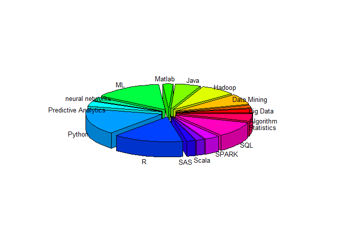

# Home Work Keek 7
Mike Martos  
June 18, 2016  


##Introduction
In this case study, We will use R web scraping and text mining technique to explore data scientist jobs using cybercoders.com. We are interested in finding a set of skills that each job post expects and want. Furthermore, we will also extract the information about salaries, location, and dateposted as well as drawing several word clouds for the skills for each job list.

### The Code
 We will make a separate function for each step, which should make the functions easier to read, test, maintain, and adjust as the format of the web pages changes. The function `cy.getFreeFormWords()` below fetches the lists of free-form text in the HTML document. The function then decomposes the text into the words in each element, using spaces and punctuation characters to separate them. This is done by calling the `asWords()` function. One of the arguements for `asWords()` is a list of "stop words", which are small words that are present in a large number of English sentences. We don't want to include these words in our list of post words. Finally, a call to `removeStopWords()` removes all stop words from the post, so that we have only the words that carry meaning for the job seeker (well, almost).


```r
require(XML)
```

```
## Loading required package: XML
```

```r
require(RCurl)
```

```
## Loading required package: RCurl
```

```
## Loading required package: bitops
```

```r
require(wordcloud)
```

```
## Loading required package: wordcloud
```

```
## Loading required package: RColorBrewer
```

```r
require(plotrix)
```

```
## Loading required package: plotrix
```

```r
require(reshape2)
```

```
## Loading required package: reshape2
```


```r
StopWords = readLines("http://jmlr.csail.mit.edu/papers/volume5/lewis04a/a11-smart-stop-list/english.stop")

asWords = function(txt, stopWords = StopWords, stem = FALSE)
{
  words = unlist(strsplit(txt, '[[:space:]!.,;#:()/"]+'))
  words = words[words != ""]
  if(stem && require(Rlibstemmer))
     words = wordStem(words)
  i = tolower(words) %in% tolower(stopWords)
  words[!i]
}

removeStopWords = function(x, stopWords = StopWords) 
     {
         if(is.character(x))
             setdiff(x, stopWords)
         else if(is.list(x))
             lapply(x, removeStopWords, stopWords)
         else
             x
     }

cy.getFreeFormWords = function(doc, stopWords = StopWords)
     {
         nodes = getNodeSet(doc, "//div[@class='job-details']/
                                 div[@data-section]")
         if(length(nodes) == 0) 
             nodes = getNodeSet(doc, "//div[@class='job-details']//p")
         
         if(length(nodes) == 0) 
             warning("did not find any nodes for the free form text in ",
                     docName(doc))
         
         words = lapply(nodes,
                        function(x)
                            strsplit(xmlValue(x), 
                                     "[[:space:][:punct:]]+"))
         
         removeStopWords(words, stopWords)
     }
```

### Question 1: Implement the following functions. Use the code we explored to extract the date posted, skill sets and salary and location information from the parsed HTML document.


```r
cy.getSkillList = function(doc)
{
  lis = getNodeSet(doc, "//div[@class = 'skills-section']//
                         li[@class = 'skill-item']//
                         span[@class = 'skill-name']")

  sapply(lis, xmlValue)
}

cy.getDatePosted = function(doc)
  { xmlValue(getNodeSet(doc, 
                     "//div[@class = 'job-details']//
                        div[@class='posted']/
                        span/following-sibling::text()")[[1]],
    trim = TRUE) 
}

cy.getLocationSalary = function(doc)
{
  ans = xpathSApply(doc, "//div[@class = 'job-info-main'][1]/div", xmlValue)
  names(ans) = c("location", "salary")
  ans
}

# cy.getSkillList(cydoc)
# cy.getLocationSalary(cydoc)
```

The function `cy.ReadPost()` given below reads each job post. This function implements three other functions: `cy.getFreeFormWords()`, `cy.getSkillList()`, and `cy.getLocationSalary()`.


```r
cy.readPost = function(u, stopWords = StopWords, ht = getForm(u))
  {
    doc = htmlParse(ht)
    ans = list(words = cy.getFreeFormWords(doc, stopWords),
         datePosted = cy.getDatePosted(doc),
         skills = cy.getSkillList(doc))
    o = cy.getLocationSalary(doc)
    ans[names(o)] = o
    ans
}
# cyFuns = list(readPost = function(u, stopWords = StopWords, doc=htmlParse(u)))
```
### Reading posts programmatically
The function `cy.ReadPost()` allows us to read a single post from CyberCoders.com in a very general format. All we need is the URL for the post. Now, let's see about obtaining the URLs using a computer program.


```r
# Obtain URLs for job posts
txt = getForm("https://www.cybercoders.com/search/", searchterms = '"Data Scientist"',
              searchlocation = "",  newsearch = "true", sorttype = "")
# Parse the links
doc = htmlParse(txt, asText = TRUE)
links = getNodeSet(doc, "//div[@class = 'job-title']/a/@href")
```

```r
# Save the links in the vector joblinks
joblinks <- getRelativeURL(as.character(links), "https://www.cybercoders.com/search/")
# Read the posts
posts <- lapply(joblinks,cy.readPost)
```

```
## Warning in getForm(u): No inputs passed to form

## Warning in getForm(u): No inputs passed to form

## Warning in getForm(u): No inputs passed to form

## Warning in getForm(u): No inputs passed to form

## Warning in getForm(u): No inputs passed to form

## Warning in getForm(u): No inputs passed to form

## Warning in getForm(u): No inputs passed to form

## Warning in getForm(u): No inputs passed to form

## Warning in getForm(u): No inputs passed to form

## Warning in getForm(u): No inputs passed to form

## Warning in getForm(u): No inputs passed to form

## Warning in getForm(u): No inputs passed to form

## Warning in getForm(u): No inputs passed to form

## Warning in getForm(u): No inputs passed to form

## Warning in getForm(u): No inputs passed to form

## Warning in getForm(u): No inputs passed to form

## Warning in getForm(u): No inputs passed to form

## Warning in getForm(u): No inputs passed to form

## Warning in getForm(u): No inputs passed to form

## Warning in getForm(u): No inputs passed to form
```

```r
cy.getPostLinks = function(doc, baseURL = "https://www.cybercoders.com/search/") 
  {
    if(is.character(doc)) doc = htmlParse(doc)
    links = getNodeSet(doc, "//div[@class = 'job-title']/a/@href") 
    getRelativeURL(as.character(links), baseURL)
}

cy.readPagePosts = function(doc, links = cy.getPostLinks(doc, baseURL),
baseURL = "https://www.cybercoders.com/search/")
  {
    if(is.character(doc)) doc = htmlParse(doc)
    lapply(links, cy.readPost)
 }

## Testing the function with the parsed version of the first page of results in object doc
posts = cy.readPagePosts(doc)
```

```
## Warning in getForm(u): No inputs passed to form

## Warning in getForm(u): No inputs passed to form

## Warning in getForm(u): No inputs passed to form

## Warning in getForm(u): No inputs passed to form

## Warning in getForm(u): No inputs passed to form

## Warning in getForm(u): No inputs passed to form

## Warning in getForm(u): No inputs passed to form

## Warning in getForm(u): No inputs passed to form

## Warning in getForm(u): No inputs passed to form

## Warning in getForm(u): No inputs passed to form

## Warning in getForm(u): No inputs passed to form

## Warning in getForm(u): No inputs passed to form

## Warning in getForm(u): No inputs passed to form

## Warning in getForm(u): No inputs passed to form

## Warning in getForm(u): No inputs passed to form

## Warning in getForm(u): No inputs passed to form

## Warning in getForm(u): No inputs passed to form

## Warning in getForm(u): No inputs passed to form

## Warning in getForm(u): No inputs passed to form

## Warning in getForm(u): No inputs passed to form
```

```r
sapply(posts,`[[`, "salary")
```

```
##            /data-scientist-job-174173 
##             " Full-time $95k - $120k" 
##            /data-scientist-job-235839 
##             " Full-time $90k - $120k" 
##            /data-scientist-job-242177 
## " Full-time Compensation Unspecified" 
##            /data-scientist-job-265235 
##            " Full-time $100k - $175k" 
##            /data-scientist-job-274101 
##            " Full-time $100k - $130k" 
##            /data-scientist-job-274858 
##            " Full-time $100k - $200k" 
##            /data-scientist-job-277796 
##             " Full-time $80k - $130k" 
##            /data-scientist-job-281149 
##            " Full-time $150k - $200k" 
##            /data-scientist-job-249258 
##            " Full-time $100k - $150k" 
##            /data-scientist-job-255121 
##            " Full-time $120k - $150k" 
##            /data-scientist-job-257925 
##            " Full-time $100k - $175k" 
##            /data-scientist-job-276157 
##            " Full-time $130k - $225k" 
##            /data-scientist-job-193909 
##            " Full-time $110k - $150k" 
##            /data-scientist-job-251622 
##             " Full-time $90k - $140k" 
##            /data-scientist-job-260813 
##            " Full-time $120k - $175k" 
##            /data-scientist-job-260413 
##             " Full-time $90k - $120k" 
##            /data-scientist-job-239316 
##             " Full-time $90k - $120k" 
##            /data-scientist-job-264954 
## " Full-time Compensation Unspecified" 
##            /data-scientist-job-267589 
##              " Full-time $0k - $140k" 
##            /data-scientist-job-273056 
##             " Full-time $90k - $160k"
```


```r
summary(sapply(posts, function(x) length(unlist(x$words))))
```

```
##    Min. 1st Qu.  Median    Mean 3rd Qu.    Max. 
##   23.00   96.25  128.00  137.80  182.20  254.00
```

**Question:** Test the `cy.getFreeFromWords()` function on several different posts.

The following code chunk pulls it all together. The function `cy.getNextPageLink()` retrieves each page from CyberCoders and calls the other functions to parse each post in order to obtain information such as salary, skills, and location.


```r
# Test of concept
# getNodeSet(doc, "//a[@rel='next']/@href")[[1]]
## A function to get all pages
cy.getNextPageLink = function(doc, baseURL = docName(doc))
{
  if(is.na(baseURL))
     baseURL = "https://www.cybercoders.com/"
  link = getNodeSet(doc, "//li[@class = 'lnk-next pager-item ']/a/@href")
  if(length(link) == 0)
    return(character())
    link2 <- gsub("./", "search/",link[[1]])
 getRelativeURL(link2, baseURL)
}

# Test the above function
tmp = cy.getNextPageLink(doc, "https://www.cybercoders.com")
```

Now we have all we need to retrieve all job posts on Cyber Coders for a given search query. The following function puts it all together into a function that we can call with a search string for a job of interest. The function submits the initial query and then reads the posts from each result page.


```r
cyberCoders =
function(query)
{
   txt = getForm("https://www.cybercoders.com/search/",
                  searchterms = query,  searchlocation = "",
                  newsearch = "true",  sorttype = "")
   doc = htmlParse(txt)

   posts = list()
   while(TRUE) {
       posts = c(posts, cy.readPagePosts(doc))
       nextPage = cy.getNextPageLink(doc)
       if(length(nextPage) == 0)
          break

       nextPage = getURLContent(nextPage)
       doc = htmlParse(nextPage, asText = TRUE)
   }
   invisible(posts)
}
```

The function cyberCoders is called below with the skill "Data Scientist". Then, we sort the skills and obtain all skills that are mentioned more than twice in the list.


```r
dataSciPosts = cyberCoders("Data Scientist")
```

```
## Warning in getForm(u): No inputs passed to form

## Warning in getForm(u): No inputs passed to form

## Warning in getForm(u): No inputs passed to form

## Warning in getForm(u): No inputs passed to form

## Warning in getForm(u): No inputs passed to form

## Warning in getForm(u): No inputs passed to form

## Warning in getForm(u): No inputs passed to form

## Warning in getForm(u): No inputs passed to form

## Warning in getForm(u): No inputs passed to form

## Warning in getForm(u): No inputs passed to form

## Warning in getForm(u): No inputs passed to form

## Warning in getForm(u): No inputs passed to form

## Warning in getForm(u): No inputs passed to form

## Warning in getForm(u): No inputs passed to form

## Warning in getForm(u): No inputs passed to form

## Warning in getForm(u): No inputs passed to form

## Warning in getForm(u): No inputs passed to form

## Warning in getForm(u): No inputs passed to form

## Warning in getForm(u): No inputs passed to form

## Warning in getForm(u): No inputs passed to form

## Warning in getForm(u): No inputs passed to form

## Warning in getForm(u): No inputs passed to form

## Warning in getForm(u): No inputs passed to form

## Warning in getForm(u): No inputs passed to form

## Warning in getForm(u): No inputs passed to form

## Warning in getForm(u): No inputs passed to form

## Warning in getForm(u): No inputs passed to form

## Warning in getForm(u): No inputs passed to form

## Warning in getForm(u): No inputs passed to form

## Warning in getForm(u): No inputs passed to form

## Warning in getForm(u): No inputs passed to form

## Warning in getForm(u): No inputs passed to form

## Warning in getForm(u): No inputs passed to form

## Warning in getForm(u): No inputs passed to form

## Warning in getForm(u): No inputs passed to form

## Warning in getForm(u): No inputs passed to form

## Warning in getForm(u): No inputs passed to form

## Warning in getForm(u): No inputs passed to form

## Warning in getForm(u): No inputs passed to form

## Warning in getForm(u): No inputs passed to form

## Warning in getForm(u): No inputs passed to form

## Warning in getForm(u): No inputs passed to form

## Warning in getForm(u): No inputs passed to form

## Warning in getForm(u): No inputs passed to form

## Warning in getForm(u): No inputs passed to form

## Warning in getForm(u): No inputs passed to form

## Warning in getForm(u): No inputs passed to form

## Warning in getForm(u): No inputs passed to form

## Warning in getForm(u): No inputs passed to form

## Warning in getForm(u): No inputs passed to form

## Warning in getForm(u): No inputs passed to form

## Warning in getForm(u): No inputs passed to form

## Warning in getForm(u): No inputs passed to form

## Warning in getForm(u): No inputs passed to form

## Warning in getForm(u): No inputs passed to form

## Warning in getForm(u): No inputs passed to form

## Warning in getForm(u): No inputs passed to form

## Warning in getForm(u): No inputs passed to form

## Warning in getForm(u): No inputs passed to form

## Warning in getForm(u): No inputs passed to form

## Warning in getForm(u): No inputs passed to form

## Warning in getForm(u): No inputs passed to form

## Warning in getForm(u): No inputs passed to form

## Warning in getForm(u): No inputs passed to form

## Warning in getForm(u): No inputs passed to form

## Warning in getForm(u): No inputs passed to form

## Warning in getForm(u): No inputs passed to form

## Warning in getForm(u): No inputs passed to form

## Warning in getForm(u): No inputs passed to form

## Warning in getForm(u): No inputs passed to form

## Warning in getForm(u): No inputs passed to form

## Warning in getForm(u): No inputs passed to form

## Warning in getForm(u): No inputs passed to form

## Warning in getForm(u): No inputs passed to form

## Warning in getForm(u): No inputs passed to form

## Warning in getForm(u): No inputs passed to form

## Warning in getForm(u): No inputs passed to form

## Warning in getForm(u): No inputs passed to form

## Warning in getForm(u): No inputs passed to form

## Warning in getForm(u): No inputs passed to form

## Warning in getForm(u): No inputs passed to form

## Warning in getForm(u): No inputs passed to form

## Warning in getForm(u): No inputs passed to form

## Warning in getForm(u): No inputs passed to form

## Warning in getForm(u): No inputs passed to form

## Warning in getForm(u): No inputs passed to form

## Warning in getForm(u): No inputs passed to form

## Warning in getForm(u): No inputs passed to form

## Warning in getForm(u): No inputs passed to form

## Warning in getForm(u): No inputs passed to form

## Warning in getForm(u): No inputs passed to form

## Warning in getForm(u): No inputs passed to form

## Warning in getForm(u): No inputs passed to form

## Warning in getForm(u): No inputs passed to form

## Warning in getForm(u): No inputs passed to form

## Warning in getForm(u): No inputs passed to form

## Warning in getForm(u): No inputs passed to form

## Warning in getForm(u): No inputs passed to form

## Warning in getForm(u): No inputs passed to form

## Warning in getForm(u): No inputs passed to form

## Warning in getForm(u): No inputs passed to form

## Warning in getForm(u): No inputs passed to form

## Warning in getForm(u): No inputs passed to form

## Warning in getForm(u): No inputs passed to form

## Warning in getForm(u): No inputs passed to form

## Warning in getForm(u): No inputs passed to form

## Warning in getForm(u): No inputs passed to form

## Warning in getForm(u): No inputs passed to form

## Warning in getForm(u): No inputs passed to form

## Warning in getForm(u): No inputs passed to form

## Warning in getForm(u): No inputs passed to form

## Warning in getForm(u): No inputs passed to form

## Warning in getForm(u): No inputs passed to form

## Warning in getForm(u): No inputs passed to form

## Warning in getForm(u): No inputs passed to form

## Warning in getForm(u): No inputs passed to form

## Warning in getForm(u): No inputs passed to form

## Warning in getForm(u): No inputs passed to form

## Warning in getForm(u): No inputs passed to form

## Warning in getForm(u): No inputs passed to form

## Warning in getForm(u): No inputs passed to form

## Warning in getForm(u): No inputs passed to form

## Warning in getForm(u): No inputs passed to form

## Warning in getForm(u): No inputs passed to form

## Warning in getForm(u): No inputs passed to form

## Warning in getForm(u): No inputs passed to form
```

```r
tt = sort(table(unlist(lapply(dataSciPosts, `[[`, "skills"))),
           decreasing = TRUE)
tt[tt >= 2]
```

```
## 
##                                          Python 
##                                              78 
##                                Machine Learning 
##                                              71 
##                                               R 
##                                              55 
##                                             SQL 
##                                              37 
##                                          Hadoop 
##                                              35 
##                                     Data Mining 
##                                              34 
##                                            Java 
##                                              26 
##                                           SPARK 
##                                              17 
##                                          Matlab 
##                                              12 
##                                 neural networks 
##                                              12 
##                             Predictive Modeling 
##                                              11 
##                                           Scala 
##                                              10 
##                                             SAS 
##                                               9 
##                                      Statistics 
##                                               9 
##                                        Big Data 
##                                               8 
##                                             NLP 
##                                               8 
##                                      Algorithms 
##                                               7 
##                                    Data Science 
##                                               7 
##                     Natural Language Processing 
##                                               7 
##                             Pattern Recognition 
##                                               6 
##                                Bash/Perl/Python 
##                                               5 
##                                             C++ 
##                                               5 
##                        Data-cleaning techniques 
##                                               5 
##                                   Data Analysis 
##                                               5 
##                                   Deep Learning 
##                                               5 
##                            Predictive Analytics 
##                                               5 
##                   Statistical modeling/analysis 
##                                               5 
##                                       Analytics 
##                                               4 
##                         Artificial Intelligence 
##                                               4 
##                                             AWS 
##                                               4 
##                                         Clojure 
##                                               4 
##                                 Computer Vision 
##                                               4 
##                              Data Visualization 
##                                               4 
##                                            Hive 
##                                               4 
##                                           MySQL 
##                                               4 
##                                      Unix/Linux 
##                                               4 
##                                           C/C++ 
##                                               3 
##                                  Cyber Security 
##                                               3 
##                                  Data Analytics 
##                                               3 
##                                 Large Data Sets 
##                                               3 
##                     Machine Learning algorithms 
##                                               3 
##                                         mongodb 
##                                               3 
##               Natural Language Processing (NLP) 
##                                               3 
##                                           NoSQL 
##                                               3 
##                                          pandas 
##                                               3 
##                       Python/Java/Ruby or Scala 
##                                               3 
##                                            Ruby 
##                                               3 
##                            Statistical Analysis 
##                                               3 
##                            time series analysis 
##                                               3 
##                     Algorithm & Data Structures 
##                                               2 
##                               Anomaly Detection 
##                                               2 
##                             Applied Mathematics 
##                                               2 
##                              Bayesian Inference 
##                                               2 
##                       Bioinformatics Algorithms 
##                                               2 
##                           Business Intelligence 
##                                               2 
##                                              C# 
##                                               2 
##                                 Clinical Trials 
##                                               2 
##                                  Data Scientist 
##                                               2 
##        Deep Learning tools such as Caffe, Torch 
##                                               2 
##                                             EDA 
##                                               2 
##            Genomics/Genetics/Biomedical/Biology 
##                                               2 
##                                          GraphX 
##                                               2 
##                              Hypothesis Testing 
##                                               2 
##                        Industrial IoT Analytics 
##                                               2 
##                                      Javascript 
##                                               2 
##                         Large Clinical Datasets 
##                                               2 
##                                           Linux 
##                                               2 
##                                   Lucene / Solr 
##                                               2 
##                    Machine Learning Algorithims 
##                                               2 
##                                       Mapreduce 
##                                               2 
##                              Model Optimization 
##                                               2 
##                                 NoSQL Databases 
##                                               2 
##                                Object Detection 
##                                               2 
##                                             PHP 
##                                               2 
##                                      PostgreSQL 
##                                               2 
##                                    Python / C++ 
##                                               2 
##                                        Python/R 
##                                               2 
##                             Regression analysis 
##                                               2 
##                        Relevant Work Experience 
##                                               2 
##                                         RESTful 
##                                               2 
## Scalable & Highly Distributed System Experience 
##                                               2 
##                                    scikit.learn 
##                                               2 
##                                     Sensor Data 
##                                               2 
##                       Spark / Hadoop / GraphLab 
##                                               2 
##                              Speech Recognition 
##                                               2 
##    Statistics/Applied Mathematics/related field 
##                                               2 
##                                         Tableau 
##                                               2 
##                             teaching experience 
##                                               2 
##                            Virtual Environments 
##                                               2
```

###Word Cloud for all skills.

The purpose to perform this task is to visualize every skills listed and see how we will plan to categorize similar skills into one group.

The max.words option sets maximum number of words to be plotted. In this case we are having maximum of 50 and least frequent skills dropped.


```r
#The option, max.words=50, sets maximum number of words to be plotted. In this case we are having maximum of 50 and least frequent skills dropped.
wordcloud(names(tt),tt,max.words = 50,colors=brewer.pal(8, "Dark2"))
```

```
## Warning in wordcloud(names(tt), tt, max.words = 50, colors =
## brewer.pal(8, : Machine Learning could not be fit on page. It will not be
## plotted.
```

<!-- -->

**Notice that we have a warning sign because the size of Machine Learning is too large to fit in one page**

###Word Cloud after Categorize

We now have the skill keywords that are mentioned more than twice in the list. We can visualize these skills using wordcloud. As we see it, we can discern similar skills are repeated several times such as Python, Python scientific stack, Python/Pandas, etc.

We will clean up the skills list using regular expressions. We also take into consideration the frequencies of skills menthoed because there are 5 or more skills that are mentioned more than 30 times.  

For the computer programming skills, we notice that several of them are stacked together. We decided only to extract the first skill along since each unique skill is on the first place on each stack. For instance, we extract R from R/Python/Matlab. We can see another stacked such as Python/R/Jave, etc. Therefore, we do not really have to worry about any left out. 

We now combine similar skills into several categories:

1) any statistical skills as "Statistics", 

2) any SQL programming skills as "SQL"

3) any Mathematical Skills as "Mathematics", this include Applied Mathematics

4) any skills related to Big Data as "Big Data"

5) any Bayesian inference skills as "Bayesian"

6) any Machine learning skills as "Machine Learning"

7) any Python programming skills as "Python", this include Python scientific stack and Python/Pandas as well.

8) any R programming skills as "R"

9) any Java, C/C++, Hadoop, Unix, Matlap, and SAS programming skills as "Java", "C/C++", "Hadoop", "Unix/Linux", "Matlap", and "SAS"

10) any Data Mining skills as "Data Mining"

11) skills that can develop and handle algorithm as "Algorithm"

12) any data analytic skills as "Data Analytics"

13) any predictable skills as "Predictive Analytics" 

14) any regression skills as "Regression Analysis", this include linear and logistic regression

15) we also include any skills related to data science and visualization as "Data Science" and "Data Visualization" because these two are very important in our Data Science Class!


```r
i = grepl("^Statist+|statist+",names(tt))
if(any(i)) names(tt)[i] = "Statistics"


j = grepl("+SQL+",names(tt))
if(any(j)) names(tt)[j] = "SQL"

k = grepl("+Math+", names(tt))
if(any(k)) names(tt)[k] = "Mathematics"

l = grepl("^Big Data+", names(tt))
if(any(l)) names(tt)[l] = "Big Data"

m = grepl("^Bayesian+", names(tt))
if(any(m)) names(tt)[m] = "Bayesian"

n= grepl("+Machine Learning+| +machine learning +", names(tt))
if(any(n)) names(tt)[n] = "ML"
#The size of "Machine Learning" is too large to put in wordcloud, so we change it as "ML"

o= grepl("^Python+", names(tt))
if(any(o)) names(tt)[o] = "Python"

p= grepl("^R+", names(tt))
if(any(p)) names(tt)[p] = "R"

q= grepl("^Java+", names(tt))
if(any(q)) names(tt)[q] = "Java"

r= grepl("^C +", names(tt))
if(any(r)) names(tt)[r] = "C/C++"

s= grepl("+Data Mining+", names(tt))
if(any(s)) names(tt)[s] = "Data Mining"

t= grepl("^Hadoop+", names(tt))
if(any(t)) names(tt)[t] = "Hadoop"

u= grepl("^Matlap+", names(tt))
if(any(u)) names(tt)[u] = "Matlap"

v= grepl("^SAS+", names(tt))
if(any(v)) names(tt)[v] = "SAS"

w= grepl("+Algorithm+", names(tt))
if(any(w)) names(tt)[w] = "Algorithm"

x= grepl("^Data Ana+", names(tt))
if(any(x)) names(tt)[x] = "Data Analytics"

y= grepl("Data Mining+", names(tt))
if(any(y)) names(tt)[y] = "Data Mining"

z= grepl("Predict+", names(tt))
if(any(z)) names(tt)[z] = "Predictive Analytics"

ii= grepl("+Regression+ | +regression+ | +Linear+", names(tt))
if(any(ii)) names(tt)[ii] = "Regression Analysis"

jj= grepl("^Unix+", names(tt))
if(any(jj)) names(tt)[jj] = "Unix/Linux"

kk= grepl("^Data Visu+", names(tt))
if(any(kk)) names(tt)[kk] = "Data Visualization"

ll= grepl("^Data Sci+", names(tt))
if(any(ll)) names(tt)[ll] = "Data Science"

tt <- tapply(tt,names(tt),sum)

length(tt)
```

```
## [1] 189
```


```r
head(tt)
```

```
##               (Python/R/PHP)                         .NET 
##                            1                            1 
## 3rd Party Geometry Libraries                       Access 
##                            1                            1 
##              Ad Optimization       Air Quality Monitoring 
##                            1                            1
```


```r
tt[tt >= 10]
```

```
##            Algorithm             Big Data          Data Mining 
##                   14                   10                   36 
##               Hadoop                 Java               Matlab 
##                   40                   29                   12 
##                   ML      neural networks Predictive Analytics 
##                   78                   12                   18 
##               Python                    R                  SAS 
##                   91                   80                   10 
##                Scala                SPARK                  SQL 
##                   10                   17                   53 
##           Statistics 
##                   26
```


#Code to show a different plot


```r
# 3D Exploded Pie Chart
pp <- melt(tt)
xx <- pp[pp$value >= 10,]
pie3D(xx$value,labels=paste(xx$Var1),explode=0.1,labelcex=0.8 )
```

<!-- -->


**Note: Machine Learning = ML**

After we categorize similar skills, this pie looks more meaningful since we only see some kind of distinctive skills. In this pie we are having skills presenting at least twice showing and least frequent skills dropped (obviously skills with frequency < 10). 


##Conclusion
###From the information posted in CyberCoders for **Data Scientist** positions the main skills required are *Python*, *Machine Learning*, *SQL* and *R*, this excercise took as back to the first unit when we were asked what a Data Scientist is, this might be a description if we focus on the skills.

##Apendix
###I had to modify the code a little bit for it to run, the first thing was to change the http to https, for some reasong it didn't work on my computer... (perhaps encryption was introduced?)

###And modified the 'cy.readPost' function, as it was not working, the following is the original version

```r
#cy.readPost = function(u, stopWords = StopWords, doc = htmlParse(u))
#  {
#    ans = list(words = cy.getFreeFormWords(doc, stopWords),
#         datePosted = cy.getDatePosted(doc),
#         skills = cy.getSkillList(doc))
#    o = cy.getLocationSalary(doc)
#    ans[names(o)] = o
#    ans
#}

#It was modified to the following:

#cy.readPost = function(u, stopWords = StopWords, ht = getForm(u))
#  {
#    doc = htmlParse(ht)
#    ans = list(words = cy.getFreeFormWords(doc, stopWords),
#         datePosted = cy.getDatePosted(doc),
#         skills = cy.getSkillList(doc))
#    o = cy.getLocationSalary(doc)
#    ans[names(o)] = o
#    ans
#}
```
